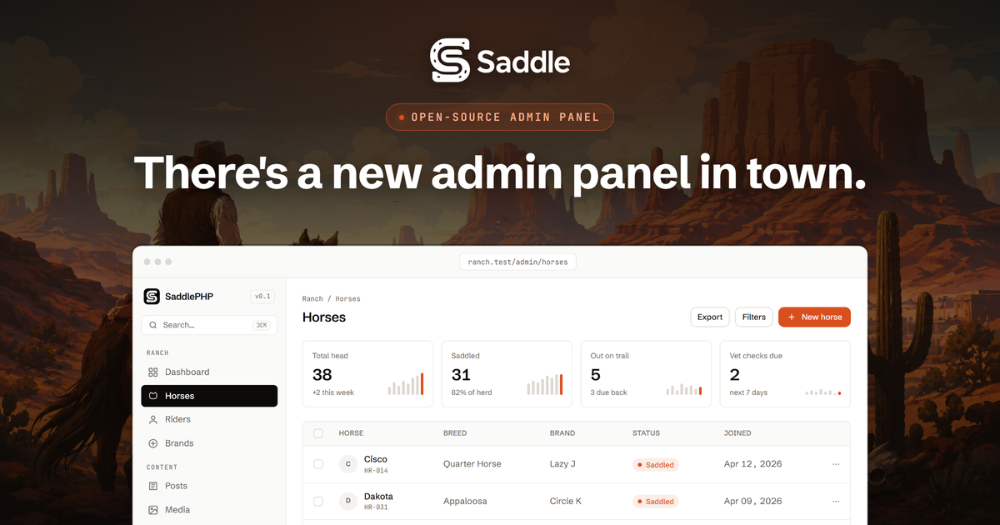

<p align="center">
  <a href="https://saddlephp.com"></a>
</p>

<p align="center">
  <em>Saddle up cowboy, there's a new admin panel in town.</em>
</p>

---

**Saddle** is the open-source admin panel framework for Laravel, built the modern way for **Inertia and
Vue**. Round up your Eloquent models into polished resource panels, with form and table builders, roles and access,
plugins, and multi-tenancy.

> **Status: v0.8 adds row and bulk actions.** The marketing site lives at **[saddlephp.com](https://saddlephp.com)** ([SaddlePHP/saddlephp.com](https://github.com/SaddlePHP/saddlephp.com)).

## Installation

```bash
composer require saddlephp/saddlephp
php artisan saddle:install
php artisan saddle:resource HorseResource --model=Horse
```

The service provider is auto-discovered. `saddle:install` publishes the config file, publishes panel assets, and creates `app/Saddle/` for your resource classes. Visit `/admin` to see the panel.

## Define a resource

Place resource classes in `app/Saddle/`. Each class extends `SaddlePHP\Resource` and implements `form()` and `table()`.

```php
<?php

declare(strict_types=1);

namespace App\Saddle;

use App\Models\Horse;
use Illuminate\Database\Eloquent\Collection;
use Illuminate\Http\Request;
use SaddlePHP\Actions\Action;
use SaddlePHP\Actions\BulkAction;
use SaddlePHP\Fields\BelongsTo;
use SaddlePHP\Fields\Date;
use SaddlePHP\Fields\DateTime;
use SaddlePHP\Fields\FileUpload;
use SaddlePHP\Fields\Markdown;
use SaddlePHP\Fields\Number;
use SaddlePHP\Fields\Select;
use SaddlePHP\Fields\Text;
use SaddlePHP\Fields\Toggle;
use SaddlePHP\Forms\Form;
use SaddlePHP\Forms\Layout\Grid;
use SaddlePHP\Forms\Layout\Section;
use SaddlePHP\Forms\Layout\Tab;
use SaddlePHP\Forms\Layout\Tabs;
use SaddlePHP\Resource;
use SaddlePHP\Tables\Columns\BadgeColumn;
use SaddlePHP\Tables\Columns\BooleanColumn;
use SaddlePHP\Tables\Columns\TextColumn;
use SaddlePHP\Tables\Filters\BooleanFilter;
use SaddlePHP\Tables\Filters\SelectFilter;
use SaddlePHP\Tables\Table;

class HorseResource extends Resource
{
    public static string $model = Horse::class;

    public static ?string $title = 'name';

    public static ?string $icon = 'collection';

    public static array $with = ['rider'];

    public static function form(Form $form): Form
    {
        return $form->schema([
            Section::make('Identity')->description('Who this horse is on the ranch.')->schema([
                Grid::make(2)->schema([
                    Text::make('name')->required()->rules('max:120'),
                    Select::make('breed')->options([
                        'quarter' => 'Quarter Horse',
                        'mustang' => 'Mustang',
                        'appaloosa' => 'Appaloosa',
                    ]),
                ]),
                FileUpload::make('photo')->image()->directory('horses')->maxSize(4096),
            ]),
            Tabs::make([
                Tab::make('Care')->schema([
                    Markdown::make('notes')
                        ->canSee(fn (Request $request) => (bool) $request->user()?->is_admin),
                    DateTime::make('last_vet_visit'),
                    Number::make('age')->integer()->min(0)->max(50),
                    Date::make('foaled_on'),
                ]),
                Tab::make('Assignment')->schema([
                    BelongsTo::make('rider')->searchable(),
                    Toggle::make('is_saddled'),
                ]),
            ]),
        ]);
    }

    public static function actions(): array
    {
        return [
            Action::make('unsaddle')
                ->handle(fn (Horse $horse) => $horse->update(['is_saddled' => false]))
                ->requiresConfirmation('Unsaddle this horse?')
                ->color('accent'),
        ];
    }

    public static function bulkActions(): array
    {
        return [
            BulkAction::make('saddle-up')
                ->label('Saddle up')
                ->handle(fn (Collection $horses) => $horses->each->update(['is_saddled' => true])),
            BulkAction::delete(),
        ];
    }

    public static function table(Table $table): Table
    {
        return $table->columns([
            TextColumn::make('name')->sortable()->searchable(),
            BadgeColumn::make('breed')->colors([
                'quarter' => 'accent',
                'mustang' => 'ink',
                'appaloosa' => 'muted',
            ]),
            BooleanColumn::make('is_saddled'),
            TextColumn::make('rider.name')->label('Rider'),
            TextColumn::make('created_at')->date('M j, Y')->sortable(),
        ])->filters([
            SelectFilter::make('breed')->options([
                'quarter' => 'Quarter Horse',
                'mustang' => 'Mustang',
                'appaloosa' => 'Appaloosa',
            ]),
            BooleanFilter::make('is_saddled'),
        ]);
    }
}
```

Resources are discovered automatically by scanning `app/Saddle/` at boot, no manual registration needed.

> **Reserved route keys.** The panel owns the static path segments `create`, `options`, and `actions` under each resource, so a record whose route key is literally one of those words is not reachable by its edit/update/delete URLs. Use an integer key or a different slug for such records.

## Form layout

Fields can be grouped into layout containers. Containers nest freely inside one another.

```php
use SaddlePHP\Forms\Layout\Grid;
use SaddlePHP\Forms\Layout\Section;
use SaddlePHP\Forms\Layout\Tab;
use SaddlePHP\Forms\Layout\Tabs;

$form->schema([
    Section::make('Identity')->description('Who this horse is on the ranch.')->schema([
        Grid::make(2)->schema([
            Text::make('name')->required(),
            Select::make('breed')->options([...]),
        ]),
        FileUpload::make('photo')->image()->directory('horses')->maxSize(4096),
    ]),
    Tabs::make([
        Tab::make('Care')->schema([
            Markdown::make('notes'),
            DateTime::make('last_vet_visit'),
        ]),
        Tab::make('Assignment')->schema([
            BelongsTo::make('rider')->searchable(),
            Toggle::make('is_saddled'),
        ]),
    ]),
]);
```

| Container | Description |
|---|---|
| `Section` | A labeled card group. `description(string)` adds a subtitle. Accepts `schema([...])` of fields and nested containers. |
| `Grid` | Arranges its children in a CSS grid. `Grid::make(2)` creates a two-column grid. Fields inside a Grid use `columnSpan(int)` to span multiple columns. |
| `Tabs` | Wraps one or more `Tab` containers in a tabbed interface. |
| `Tab` | A single pane inside a `Tabs` group. `Tab::make('Label')->schema([...])`. When any field inside a tab fails validation, the tab shows an error indicator so users can locate the problem without switching to every pane. |

**Flat schemas still work.** Passing a plain list of fields to `$form->schema([...])` with no containers is fully supported and produces the same layout as before. Validation and authorization treat fields identically regardless of whether they live inside a container or at the top level.

## Fields

| Field | Description |
|---|---|
| `Text` | Single-line text input. Modifiers: `required()`, `rules(string\|array)`, `placeholder()`. |
| `Textarea` | Multi-line text input. Modifiers: `rows(int)`. |
| `Select` | Fixed-options dropdown. Pass an associative array to `options(['value' => 'Label'])`. |
| `Toggle` | Boolean switch. Stores `true`/`false`. |
| `BelongsTo` | Relation select. The argument is the Eloquent relation method name on the model (`BelongsTo::make('rider')` reads `$model->rider()` and submits the foreign key). Option labels resolve from `titleAttribute('name')`, falling back to the related model's registered resource `$title`, then its key. If neither a `titleAttribute()` nor a registered resource is available, options are labeled by primary key, so set `titleAttribute('name')` for readable labels. Options are capped at 100 by default; override with `limit(int)`. `searchable()` switches to an async picker that searches the related table as you type via an authenticated endpoint; on edit, only the current selection is embedded (the full list is not loaded). `modifyOptionsQuery(fn ($query) => ...)` scopes the option list for tenancy or visibility; it applies to listed and searched options, while a record's saved selection keeps rendering its label even when it falls outside the scope. |
| `Number` | Numeric input. Modifiers: `min()`, `max()`, `step()`, `integer()`. |
| `Date` | Date input. Values render as `Y-m-d`. |
| `DateTime` | Date-and-time input (`datetime-local`). Values are stored and read back via your model's datetime cast; a `DateTimeInterface` value is formatted to `Y-m-d\TH:i` for the browser. |
| `Markdown` | Textarea with a formatting toolbar. Stored as a plain string and bounded to 65 535 characters (equivalent to a MySQL `TEXT` column). |
| `FileUpload` | Multipart file upload. Modifiers: `disk(string)`, `directory(string)`, `image()` (restricts to image types), `acceptedTypes(array)` (MIME extensions, e.g. `['pdf', 'docx']`), `maxSize(int $kilobytes)`. The stored value is the file path returned by `Storage::put`. On the edit form: leaving the input untouched keeps the existing file, clearing it stores `null`, and picking a new file replaces the path. Replaced or cleared files are not deleted from disk automatically. |

## Columns

| Column | Description |
|---|---|
| `TextColumn` | Renders the raw attribute value. Modifiers: `sortable()`, `searchable()`, `label(string)`, `date(string $format)` (formats DateTime attributes; default format `Y-m-d H:i`). |
| `BadgeColumn` | Renders a pill badge. Use `colors(['value' => 'token'])` to map option values to color tokens (`accent`, `ink`, `muted`). |
| `BooleanColumn` | Renders a check mark for truthy values and a dash for falsy ones. |

**Relation columns and eager loading.** Dotted names like `TextColumn::make('rider.name')` read through a loaded relation. Declare `public static array $with = ['rider']` on the resource so the index query eager-loads the relation before rendering. Relation columns are not sortable or searchable yet.

## Filters

Filters are declared on the table via `->filters([...])`. On the index, the panel applies them from `filter[name]=value` query string parameters. Requested values are validated against the declaration, so unknown filter names and undeclared option values are silently ignored.

| Filter | Description |
|---|---|
| `SelectFilter` | Exact-match dropdown. `options(['value' => 'Label'])` defines both the dropdown choices and the allowlist of accepted values. |
| `BooleanFilter` | Yes/No dropdown over a boolean column. |

## Actions

Actions appear as buttons on each row of the index table. Bulk actions appear in a toolbar when one or more rows are selected.

```php
use SaddlePHP\Actions\Action;
use SaddlePHP\Actions\BulkAction;

public static function actions(): array
{
    return [
        Action::make('unsaddle')
            ->handle(fn (Horse $horse) => $horse->update(['is_saddled' => false]))
            ->requiresConfirmation('Unsaddle this horse?')
            ->color('accent'),
    ];
}

public static function bulkActions(): array
{
    return [
        BulkAction::make('saddle-up')
            ->label('Saddle up')
            ->handle(fn (Collection $horses) => $horses->each->update(['is_saddled' => true])),
        BulkAction::delete(),
    ];
}
```

| Fluent | Description |
|---|---|
| `label(string)` | Display label shown on the button. When omitted, the name is converted to title case. |
| `color(string)` | Color token for the button: `accent`, `ink`, or `muted`. Defaults to `ink`. |
| `requiresConfirmation(?string)` | Show a confirmation dialog before running. Pass a custom message or omit to use the default prompt. |
| `authorize(string)` | Name a policy ability checked per record before the handler runs. |
| `successMessage(string)` | Flash message shown after a successful run. Defaults to `Done.`. |

Actions post to a guarded endpoint. Records resolve through the same scoped base query used everywhere else, so tenancy, filters, and per-resource query scopes apply automatically. When `authorize('ability')` is declared, the policy is checked per record before the handler runs. Bulk runs execute inside a database transaction and are capped at 100 records per request; if any requested record is missing from the scoped fetch the entire operation aborts with 404 rather than silently applying to the subset that resolved. Declare `authorize()` on any destructive action.

`BulkAction::delete()` is a pre-built preset: name `delete`, label `Delete`, color `accent`, confirmation `Delete the selected records?`, and `authorize('delete')` already wired.

## Authorization

Saddle consumes standard Laravel policies. Register a policy for a model and the panel enforces it everywhere: index, forms, row actions, and relation pickers. With no policy registered, all abilities are allowed for every authenticated user. Roles stay in your application: any role package or homegrown layer that backs your policies works unchanged.

### Lock the panel down

Resources without a registered policy allow every authenticated user by default. Set `saddle.authorization.require_policy` to `true` to fail closed: resources without a policy become inaccessible rather than open. You can also add a gate middleware to `saddle.middleware` for a blanket check before any panel route runs. If your web guard is shared between end-users and administrators, one of these controls is essential.

| Ability | Where it is checked |
|---|---|
| `viewAny` | Resource index page, sidebar visibility |
| `create` | Create form, store action, relation options endpoint |
| `update` | Edit form, update action, per-row Edit link, relation options endpoint (checked against a fresh model when no record is in scope) |
| `delete` | Destroy action, per-row Delete button |

### Field visibility with `canSee`

Individual fields can be gated per request using `canSee`. The `notes` field in `HorseResource` is a working example:

```php
use Illuminate\Http\Request;

Textarea::make('notes')->rows(3)
    ->canSee(fn (Request $request) => (bool) $request->user()?->is_admin),
```

Hidden fields are stripped from the form payload (stored values are never serialized to the frontend), contribute no validation rules, are never written on save, and their relation options endpoint returns 404. The callback may run several times per request, so keep it cheap and return a real boolean. For example, use `Gate::allows('view-notes', $model)` rather than `Gate::inspect(...)`, whose `Response` object is always truthy and will never hide the field.

## Plugins

A plugin is a regular Composer package. Its service provider registers resources, scripts, and styles through the `Saddle` facade, and Laravel's package auto-discovery boots it automatically alongside your application.

```php
public function boot(): void
{
    Saddle::register([MoodBoardResource::class]);
    Saddle::script('/vendor/mood-board/field.js');
    Saddle::style('/vendor/mood-board/field.css');
}
```

Publish compiled assets from the plugin's service provider to `public/vendor/{plugin}` using the standard `$this->publishes([...])` mechanism, then point `Saddle::script()` at the published path. Plugin scripts and stylesheets are loaded on every panel page after the core panel bundle.

### Custom elements

Plugins can ship their own field and column renderers as custom elements. On the PHP side:

```php
CustomField::make('mood')->tag('mood-picker')->rules('max:32'),
CustomColumn::make('mood')->tag('mood-cell'),
```

The panel fulfils this contract: for fields, it sets the element's `value` and `field` DOM properties and listens for a `saddle:input` CustomEvent whose `detail` is the new value. For columns, it sets `value` and `column` DOM properties (read-only; no input event expected).

A minimal vanilla custom element implementing the field contract:

```js
class MoodPicker extends HTMLElement {
    connectedCallback() {
        // The panel may set the value property before the element is
        // connected, so seed the input from whatever arrived early.
        this._input = document.createElement('input');
        this._input.value = this._value ?? '';
        this._input.addEventListener('input', () => {
            this.dispatchEvent(new CustomEvent('saddle:input', {
                bubbles: true,
                detail: this._input.value.toUpperCase(),
            }));
        });
        this.appendChild(this._input);
    }

    set value(v) {
        this._value = v ?? '';
        if (this._input) this._input.value = this._value;
    }

    get value() { return this._input ? this._input.value : (this._value ?? ''); }
}

customElements.define('mood-picker', MoodPicker);
```

Define elements at the top level of your script; the browser upgrades any matching elements the panel has already rendered as soon as `customElements.define` runs, so load order never matters.

The contract is framework-agnostic. Anything that compiles to a standard custom element works: Vue's `defineCustomElement`, Lit, React or Svelte wrappers. Plugin authors are not tied to the panel's internals.

## Multi-tenancy

Saddle supports opt-in, URL-scoped multi-tenancy. Enable it by pointing `tenancy.model` at any Eloquent class:

```php
// config/saddle.php
'tenancy' => [
    'model' => App\Models\Ranch::class, // null disables (default)
    'relationship' => 'users',          // relation that lists the tenant's members
],
```

When tenancy is active, the panel mounts under `/admin/{tenant}` instead of `/admin`. The `{tenant}` segment resolves by route-key lookup on the configured model. Unknown tenant keys return **404**; authenticated users who are not a member of the resolved tenant are rejected with **403**.

### Scoping resources

Declare the record's BelongsTo relationship to the tenant on each resource you want scoped:

```php
class HorseResource extends Resource
{
    public static ?string $tenant = 'ranch'; // Eloquent relation name on Horse
}
```

Resources without `$tenant` (shared lookup tables, global configuration) remain unscoped by design.

### Automatic scope guarantees

Every data path checks the bound tenant server-side:

- **Index, search, and filters** run through the scoped base query (`whereBelongsTo` on the declared relation).
- **Record lookups** for edit, update, and destroy resolve via the same scoped query, so cross-tenant IDs return 404 before any policy runs.
- **Stores** stamp the current tenant server-side after filling the form. Any tenant foreign key submitted by the client is overwritten.
- **Relation option lists** apply the same scope when the related model's registered resource is also tenant-scoped.

### Tenant switcher

When the authenticated user belongs to more than one tenant, the panel sidebar shows a select that lists all their memberships. Switching navigates to the same panel path under the selected tenant.

### Caveats

- **Do not expose the `$tenant` relation as a form field on a scoped resource.** The store controller stamps the relationship server-side, but an editable BelongsTo field pointing at the tenant relation on an update form would let a submitted value re-point the record to a different tenant.
- **A saved relation label still renders on the edit form even when the related row falls outside the current scope.** `BelongsTo` resolves the current selection with an unscoped query so the label never disappears after a scope change. Only the option list for new selections is filtered.
- **Changing the tenancy config requires `php artisan route:clear`**, because the `{tenant}` prefix is decided at boot. Long-running application servers (FPM workers kept alive across requests) must ensure that request state is reset between requests; the bound tenant lives on the Saddle singleton, which is resolved fresh per request under the default container lifetime. When Octane is installed, the panel resets the bound tenant automatically via the Octane request-lifecycle hooks.

## Configuration

`saddle:install` publishes `config/saddle.php`. Available keys:

| Key | Default | Description |
|---|---|---|
| `path` | `'admin'` | URL prefix for the panel (e.g. `'admin'` → `/admin`). |
| `middleware` | `['web', 'auth']` | Middleware stack applied to all panel routes. |
| `resources.path` | `app_path('Saddle')` | Filesystem path scanned for resource classes. |
| `resources.namespace` | `'App\\Saddle'` | PHP namespace corresponding to `resources.path`. |
| `per_page` | `25` | Default rows per page on index tables. |
| `brand.name` | `'Saddle'` | Panel name (sidebar + browser tab). |
| `brand.accent` | `'#d9501f'` | Accent colour (buttons, active states). |
| `uploads.disk` | `'public'` | Default filesystem disk used by `FileUpload` fields when no per-field `disk()` is set. |
| `uploads.directory` | `'saddle'` | Default upload directory within the disk when no per-field `directory()` is set. |

## Commands

| Command | Description |
|---|---|
| `saddle:install` | Publish config, publish panel assets, create `app/Saddle/`. Offers to add `saddle:upgrade` to `composer post-update-cmd` so assets stay fresh. |
| `saddle:upgrade` | Re-publish panel assets. Run after every package update. |
| `saddle:resource NameResource --model=Name` | Scaffold a new resource class. The `--model` option is optional; it is inferred from the resource name when omitted. |

**Deploy note.** Add `php artisan saddle:upgrade` to your deploy script after `composer install` or `composer update`. The panel displays a warning banner in the UI when the published assets are out of sync with the installed package version.

## Local development

```bash
composer install
npm install
npm run build
vendor/bin/pest
```

The `workbench/` directory contains a minimal host application used by the test suite and for manual poking. `vendor/bin/testbench serve` boots it with `HorseResource` registered; note that panel routes sit behind the `auth` middleware and the workbench ships only a stub `/login` route, so for interactive browsing either temporarily set `'middleware' => ['web']` in `config/saddle.php` or browse through the feature tests instead. There is no demo seeder yet.

## Roadmap

- [x] Resource panels (CRUD from an Eloquent model)
- [x] Form builder
- [x] Table builder
- [x] Relations (BelongsTo)
- [x] Table filters
- [x] Roles and access (policy-driven)
- [x] Plugins
- [x] Multi-tenancy
- [x] Form layout and uploads
- [x] Row and bulk actions

## Stack

Built for **Laravel 13+ / PHP 8.4+**, **Inertia 2**, **Vue 3**, **Tailwind CSS 4**.

## License

MIT.
